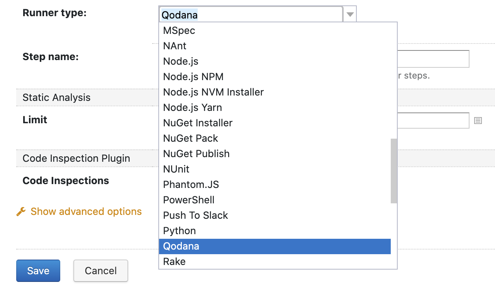

# Qodana TeamCity Plugin

Qodana TeamCity Plugin lets you add static analysis to your build chain.

The plugin provides:
* Build runner
* Convenient UI
* Integration with TeamCity tests support
* Smart and flexible build comparison
* Pliable build failure conditions

The plugin gives you the opportunity to add the code quality checks in the TeamCity pipeline or even start from 
scratch with static code analysis.


### Quick Start Guide

Download and install Qodana plugin form JetBrains Marketplace on your TeamCity server or contact the server's 
administrator to do this.

When the plugin installed, add Qodana runner to your build. If your project language is included in the list of 
fully [supported technologies](../General/supported-technologies.md), you don't need further preparation. You can 
have your first analysis with default setting right away.   



Ensure the checkbox is set and start the build.


If you use DSL to configure your build, add this section to your build configuration description.
```
 steps {
    ...
    qodana {}
 }    
```

If the technologies you use in your projects are not fully supported, you may need an additional steps in your build 
to download dependencies and so on.

Temporary limitation: more than one Qodana build step in the build are not supported in the current version. If you 
need to aggregate the analysis of several builds into one please use TeamCity Composite Build Configuration feature.

After your build is finished, you will see *Qodana* tab within your build overview page. Please note that the tab 
can be hidden under *More* section. Just mark Qodana tab with a star, and you will see it in all builds with such step.

Mostly all [UI features](../UI/README.md) of Qodana tab are similar between all Qodana tools we provide. They are 
sufficient for exploring the result of the single run, but TeamCity tab gives even more. You can easily compare two 
builds and focus on the difference. At the moment the comparison is limited within a single build configuration, but 
we are working to provide cross-configuration option as well. 

### Configuration

The main Qodana functionality comes from the 'engine' shaped into the docker image. If you want to go beyond the 
boundaries of the default settings, please refer to the [docker image guide](../Docker%20Image/README.md). Except 
you don't need to write `docker run` on your own, the plugin will do it for you. You can just use all other options 
and provide them via the dedicated UI or DSL properties. 

### Advanced Configuration 

The advanced configuration allows you to report all found problems via TeamCity standard test mechanism. It means 
you can assign investigation, mute, see history and do all other thins you are doing with test in TeamCity. Qodana 
reports test in four different ways:

- per problem
- per inspection type
- per inspection type/per module (if this information is available)
- per inspection type/per file

