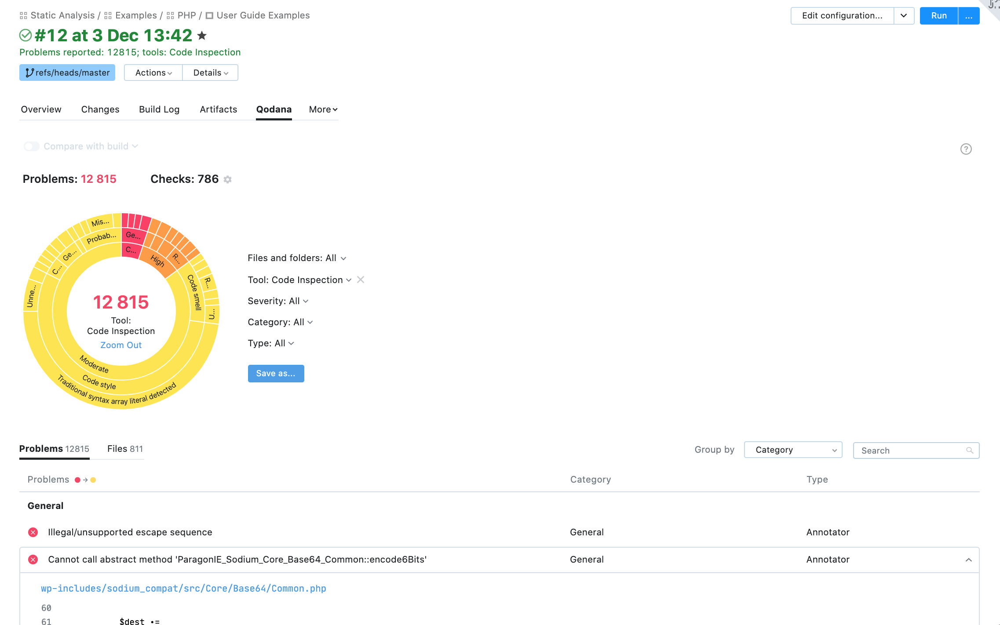

# Qodana TeamCity Plugin

Qodana TeamCity Plugin lets you add static analysis to your build chain.

The plugin provides:
* Build runner
* Convenient UI
* Integration with TeamCity tests support
* Smart and flexible builds comparison
* Pliable build failure conditions

The plugin lets you add the code quality checks in the TeamCity pipeline or even start from scratch with static code analysis.



### Quick Start Guide

Download and install the Qodana plugin form JetBrains Marketplace on your TeamCity server or contact the server's administrator to do this.

With the plugin installed, add the Qodana runner to your build. If your project language is included in the list of 
fully [supported technologies](../General/supported-technologies.md), no further preparation is needed. You can 
have your first analysis with default setting right away.   


Ensure the checkbox is selected and start the build.


If you use DSL to configure your build, add this section to your build configuration description.
```
 steps {
    ...
    qodana {}
 }    
```

If your projects rely on technologies that are not fully supported, you may need additional steps in your build to download dependencies and so on.

Temporary limitation: having more than one Qodana build step in the build is not supported in the current version. If you 
need to aggregate the analysis of several builds into one, use the TeamCity Composite Build Configuration feature.

After the build is finished, you will see the *Qodana* tab on your build overview page. Note that the tab 
can be hidden under the *More* section. To see it in all builds with such step, mark the *Qodana* tab with a star.

Almost all [UI features](../UI/README.md) of the *Qodana* tab are similar between all Qodana tools we provide. They are 
sufficient for exploring the results of a single run, but the *TeamCity* tab gives even more. You can easily compare two 
builds and focus on the difference. Now the comparison is limited to a single build configuration, but 
we are working to provide the cross-configuration option as well. 

### Configuration

The main Qodana functionality comes from the 'engine' shaped into the Docker image. If you want to go beyond the 
boundaries of the default settings, refer to the [Docker image guide](../Docker/README.md). Note that you don't need to write `docker run` on your own, since the plugin will do it for you. You can just use all other options and provide them via the dedicated UI or DSL properties. 

### Advanced Configuration 

Advanced configuration lets you report all found problems via the TeamCity standard tests mechanism. It means 
you can assign investigations, mute, see history, and everything else you are doing with tests in TeamCity. Qodana 
reports tests in four different ways:

- per problem
- per inspection type
- per inspection type/per module (if this information is available)
- per inspection type/per file

### License
By using the Qodana plugin, you agree to [JetBrains EAP user agreement](https://www.jetbrains.com/legal/agreements/user_eap.html) and [JetBrains privacy policy](https://www.jetbrains.com/company/privacy.html).

## Contact
Contact us at [qodana-support@jetbrains.com](mailto:qodana-support@jetbrains.com) or via [our issue tracker](https://youtrack.jetbrains.com/newIssue?project=QD). We eagerly want your feedback on what's already there and if there are any features that we miss.