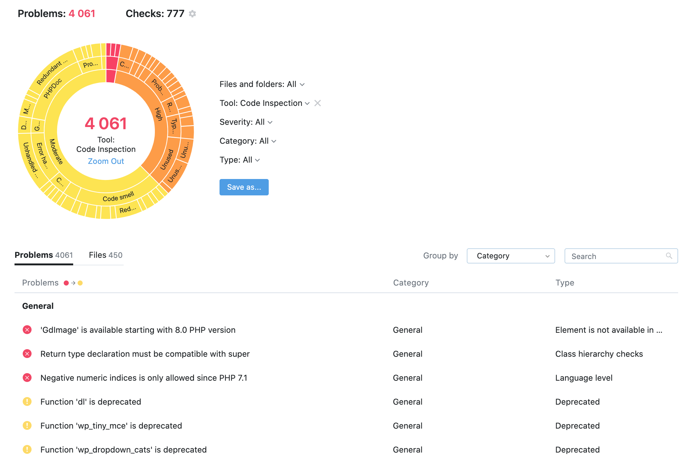
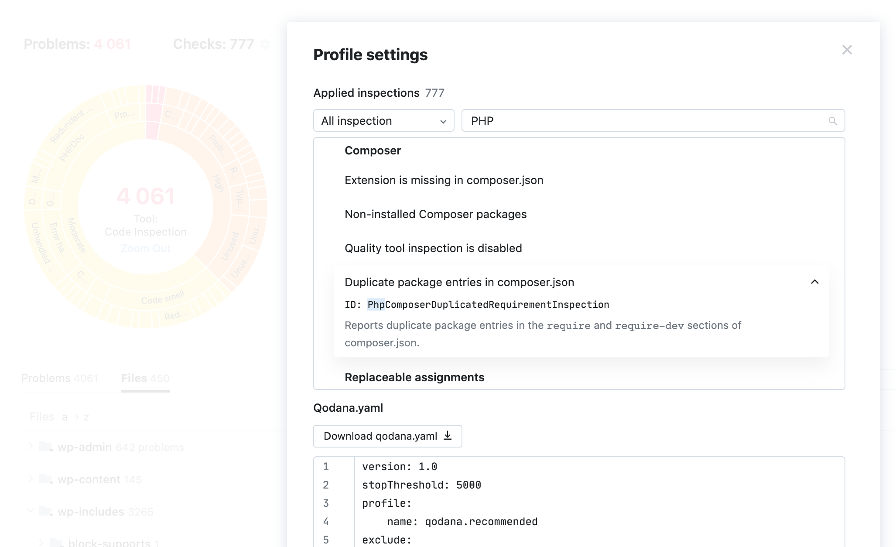

# Qodana. User Interface

The current version of Qodana UI is focused on the single-shot analysis. It allows browsing and acting 
on results as well as re-configuring the list of checks. 

### Problem Explorer

The interactive sunburst gives you an idea of how bad the situation is, what problems are most pronounced, and lets you drill down. It is a result of our initial research and experiments. Since visual representation dramatically enhances understanding of the data, we’ll be focusing on creating more insightful views. We are open to feedback and encourage you to share your feelings and ideas!
Feel free to contact us via [qodana-support@jetbrains.com](mailto:qodana-support@jetbrains.com) or [our issue tracker](https://youtrack.jetbrains.com/newIssue?project=QD).

Each line in the table under the sunburst is expandable and provides all the necessary details on the problem including 
the surrounding code. If you have JetBrains Toolbox installed, the *Open in IDE* button lets you quickly jump to the editor.

If you figured out that the problem is not relevant, you can adjust the analysis based on the reason why you feel this:

1) The analysis of the file with the error, or even the folder containing this file, doesn't make sense in your project.
  *For example, it's not source code actually, but some generated or downloaded content*
  
  In this case you can *exclude* a file or folder from the future analysis. Click the file path to navigate to *File explorer*, where you can re-check the condition and mark the file/folder as *excluded*.

2) You feel that the type of an error or its category is not relevant.
  In this case you can use the *hide* action and remove the whole type or category.

    
If you excluded either type/category or file/folder, the UI will remind you to save changes. Download the `qodana.yaml` file and store it under your project's root folder.

### Files Explorer

The second tab in the problems table shows problems grouped by files and folders.

### Reviewing and Adjusting Configuration

We believe that the ability to see what was checked is as important as the list of problems found. If you didn't check for 
typos, for example, you can be happy seeing zero typos in your project. There can be many of them, you just didn't check. So we've 
exposed the *Checks* section, which lets you easily see what's included, and you can also explore what to add. Our recommended profile includes the most common inspections, but knowing your project you can tailor your 
experience better. 

You can *Enable* the inspection, and it will be added to your configuration. The UI will remind you to download and save `qodana.yaml` in your project root folder.

Run the analysis again with updated `qodana.yaml` and ensure you see the expected results. 

If the number of errors is manageable, you can fix them and consider the 'Problems-free code' goal achieved. You are now ready to perform the 
analysis on the daily basis :) You need to keep your goal and fix the errors as soon as they come. 

If there are too many errors, we suggest using the Qodana UI features to examine them. You can then formalize a not-so-big cluster of the problems to fix. Then repeat the procedure to work on the next goal, and 
so on. 

We are working on the so-called *technical debt* support, which will help in the situation when you have no possibility to fix old problems but want to prevent the appearance  of new ones. Stay tuned! 

